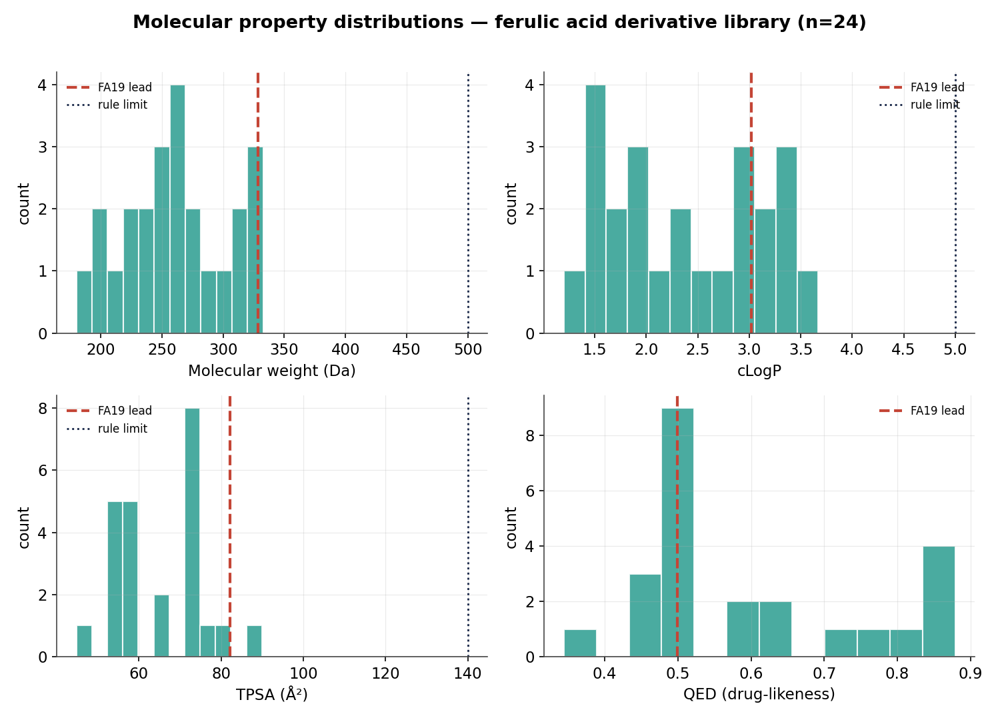
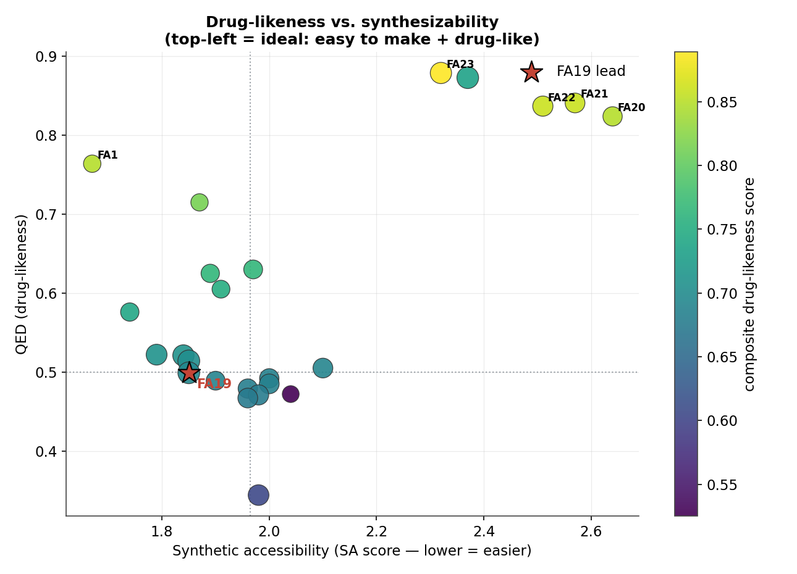
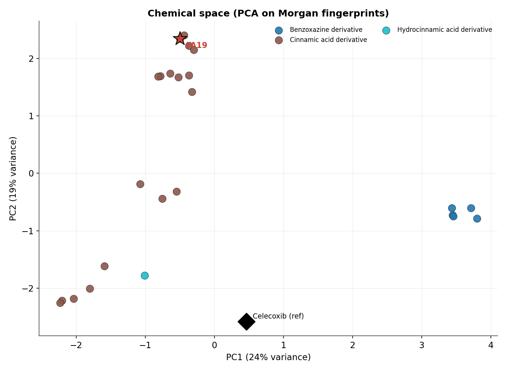
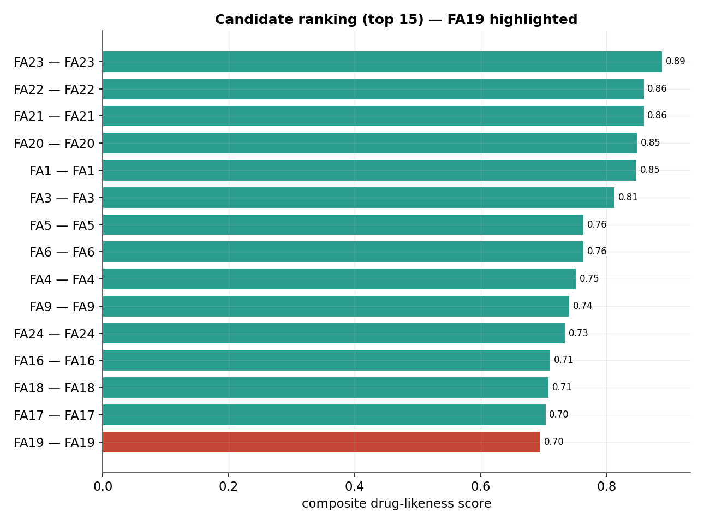
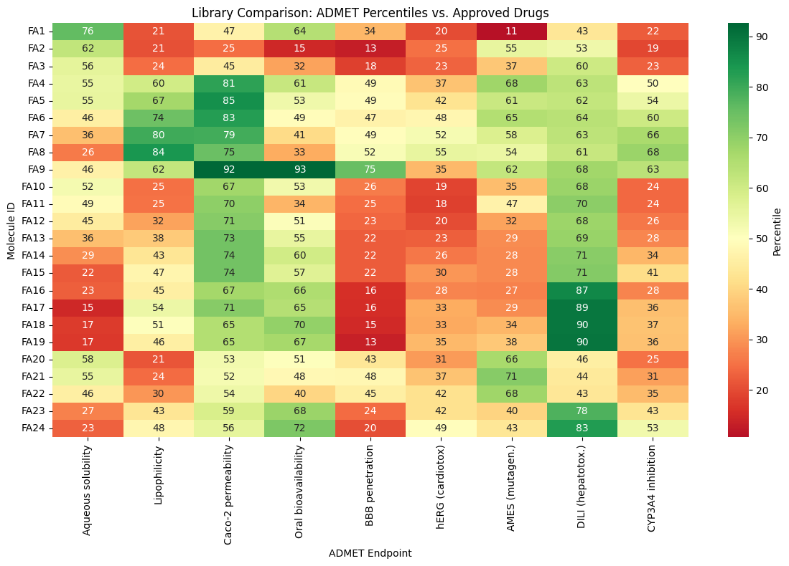
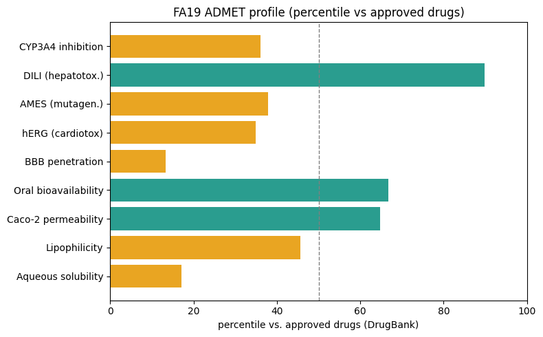
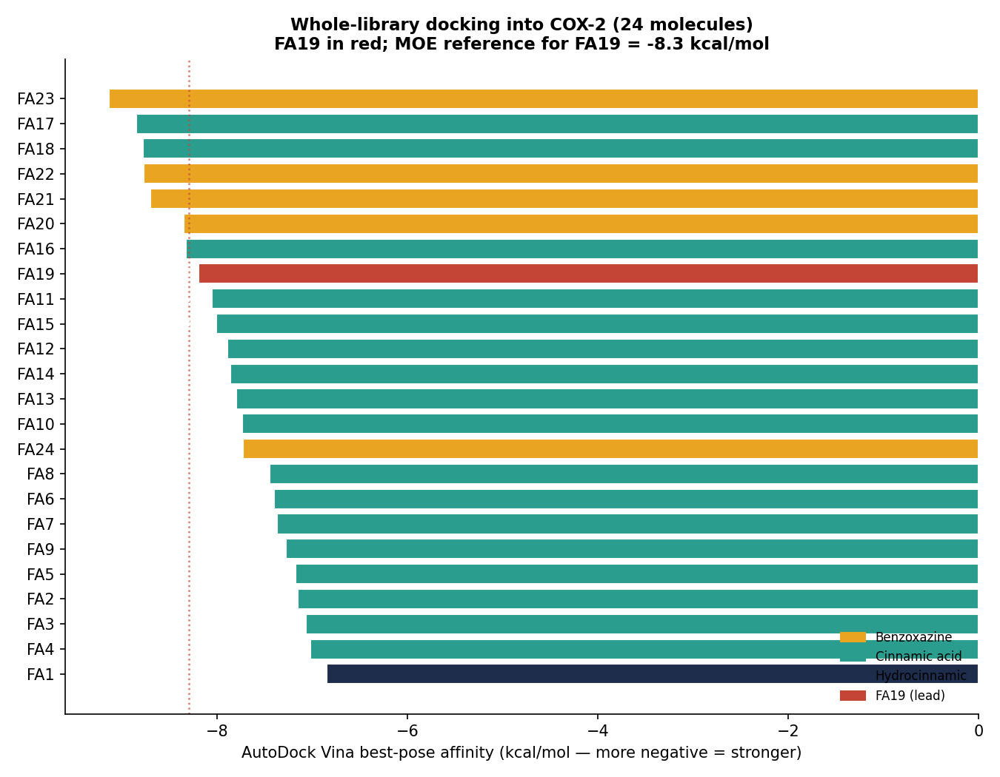
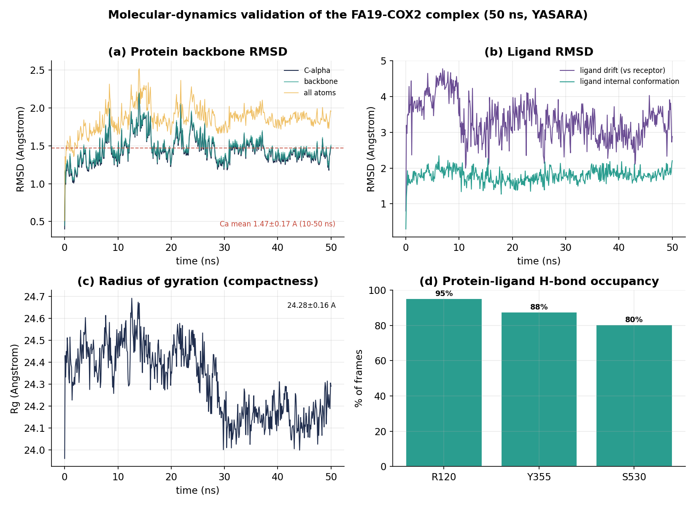
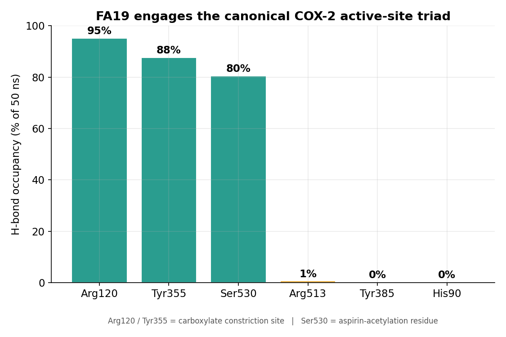
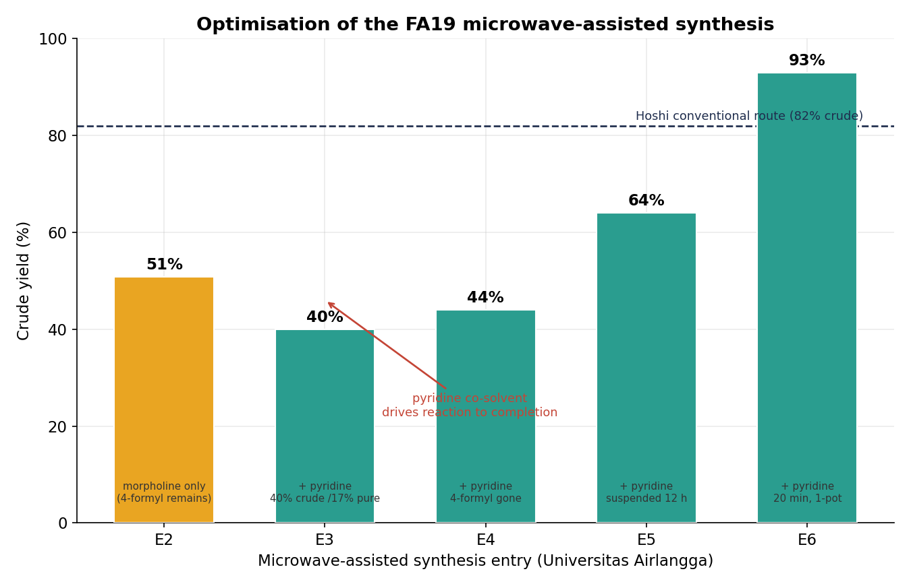

# Rational Design of a Novel Ferulic Acid Derivative Targeting COX-2 in Breast Cancer

**An end-to-end computational drug-discovery project — executed by a pharmacist.**
Virtual screening → molecular docking → molecular-dynamics validation → green-chemistry synthesis, run as a complete industry-style **DMTA (Design–Make–Test–Analyse)** cycle on a single lead candidate, **FA19**.

   

---

## TL;DR

I took a virtual library of ferulic acid derivatives, screened it computationally, identified a lead that binds the COX-2 selectivity pocket, validated its stability by molecular dynamics, and synthesized it with a green-chemistry route — then packaged the whole thing as reproducible code. This repository is the computational core: **a screening pipeline you can clone and run, a docking notebook, and a screening report generated entirely from the code's own output.**

The lead, **FA19** (*4-(2-carboxyvinyl)-2-methoxyphenyl 4-methoxybenzoate*, C18H16O6), introduces a bulky 4-methoxybenzoyl group designed to occupy the hydrophobic accessory pocket that distinguishes COX-2 from COX-1, improving predicted binding from ~−5.5 kcal/mol (parent) to **−8.3 kcal/mol** (MOE).

📄 **Start here: [`FA19_portfolio_case_study.pdf`](FA19_portfolio_case_study.pdf)** — the full end-to-end story (design → dock → MD → synthesis → pitch) in one document.

---

## The DMTA pipeline

| Phase | What was done | Tools | Status in this repo |
|------|----------------|-------|---------------------|
| **Design** | Screen the real 24-compound library (FA1–FA24): properties, drug-likeness, synthesizability, chemical space | RDKit, scikit-learn | ✅ Code + report |
| **Predict (AI/ML)** | ADMET profile (40+ endpoints) for all 24 + a COX-2 QSAR potency model | ADMET-AI, ChEMBL, scikit-learn | ✅ Notebooks + figures |
| **Test (dock)** | Dock the whole library into COX-2 (PDB 3LN1) + cross-validate the MOE score | AutoDock Vina, Meeko | ✅ Batch + single notebooks |
| **Analyse (MD)** | 50 ns MD of the FA19–COX-2 complex; RMSD, Rg, H-bond occupancy | YASARA, matplotlib | ✅ Analysis + figures |
| **Make** | Green-chemistry, microwave-assisted, one-pot synthesis; NMR + FTIR confirmation | Wet lab, NMR / FTIR | ✅ Documented + figure |

---

## What's in here

```
ferulic-cox2-screening/
├── README.md
├── requirements.txt
├── FA19_portfolio_case_study.pdf       # ⭐ the full end-to-end case study
├── FA19_virtual_screening_report.pdf   # screening deep-dive (generated from output)
├── src/
│   ├── screen.py                 # library + descriptors + drug-likeness funnel + ranking
│   ├── plots.py                  # property figures + PCA chemical space + Butina clustering
│   ├── build_report.py           # assembles the screening-report PDF
│   ├── md_analysis.py            # parses YASARA trajectory -> RMSD/Rg/H-bond figures + stats
│   ├── synthesis_optimization.py # yield-optimization figure from wet-lab data
│   ├── build_portfolio.py        # assembles the full portfolio case-study PDF
│   └── qsar_template.py          # supervised ML scaffold (needs labelled ChEMBL data)
├── notebooks/
│   ├── Batch_Docking_Library_Vina.ipynb      # dock ALL 24 into COX-2, ranked  ⭐
│   ├── FA19_COX2_Vina_redocking.ipynb         # single-ligand annotated docking
│   ├── Molecular_Docking_Tutorial_OpenSource.ipynb  # learn docking from scratch
│   ├── AI_Docking_gnina_FA19_COX2.ipynb       # CNN-scored (AI) docking
│   ├── ADMET_profiling_ADMET-AI.ipynb         # 50+ ADMET endpoints (executed)
│   ├── QSAR_COX2_v2_PubChem_REST.ipynb        # COX-2 potency model (executed)
│   └── GROMACS_MD_simple.ipynb                # full MD workflow (verified)
├── data/
│   ├── library.csv               # the real FA1–FA24 SMILES
│   ├── screening_results.csv     # full descriptor + filter + score table
│   ├── chemical_space.csv        # PCA coordinates + cluster assignments
│   ├── summary.json
│   └── md_summary.json           # MD stability + H-bond statistics
└── figures/                      # all generated figures (screening, ADMET, MD, synthesis)
```

---

## Reproduce it

```bash
pip install -r requirements.txt
python src/screen.py        # -> data/screening_results.csv, summary.json  (reads data/library.csv)
python src/plots.py         # -> figures/*.png, chemical_space.csv
python src/build_report.py  # -> FA19_virtual_screening_report.pdf
python src/md_analysis.py   # -> MD figures + data/md_summary.json   (needs the YASARA .tab)
python src/synthesis_optimization.py  # -> figures/make1_yield_optimization.png
python src/build_portfolio.py         # -> FA19_portfolio_case_study.pdf
```

`screen.py` reads `data/library.csv` directly (columns `id, smiles`, optional `name, klass`), so swapping in a different library needs no code change. The ADMET, QSAR, and docking notebooks run in Google Colab.

---

## Results — Design & Test

The real 24-compound library (FA1–FA24): a hydrocinnamic acid (FA1), a series of cinnamic acid derivatives (FA2–FA19, including the parent acids, alkyl esters, and phenolic acylations), and benzoxazine-fused analogues (FA20–FA24). All were profiled and pushed through a transparent screening funnel.

**Headline finding:** **22 of 24 compounds clear the drug-likeness gate** (≤1 Lipinski violation, Veber-compliant, no PAINS alerts). The two exceptions — **FA2 (caffeic acid, whose catechol is a known PAINS motif) and FA24 (an N-aryl benzoxazine)** — are flagged by PAINS, *not* by physicochemical rules. The lead **FA19 ranks #15 of 24 on drug-likeness alone** (QED 0.50, SA score 1.85, 0 Lipinski violations); the benzoxazines (FA20–FA23) top the drug-likeness ranking.

> **This is the point, not a problem.** FA19 is not the most drug-like molecule — it is the best *binder* among molecules that are all developable. That is exactly how a real screening funnel selects a lead: filter for clean properties, then let docking decide. "Selected by docking from a clean pool" is a far more credible story than "best at everything."

| Property | FA19 | Library context |
|---|---|---|
| Molecular weight | 328 Da | within Ro5 |
| cLogP | 3.0 | within Ro5 |
| QED (RDKit, default) | 0.50 | mid-pack (#15/24) |
| SA score (1 easy – 10 hard) | 1.85 | highly synthesizable |
| Lipinski violations | 0 | passes gate |
| PAINS / Brenk alerts | 0 / 0 | clean |

**Chemical space (PCA + Butina):** PC1+PC2 capture ~44% of variance; clustering resolves 5 chemotype families. Celecoxib (reference COX-2 inhibitor) lies far from every derivative — the ferulic series occupies **novel chemical space** rather than mimicking a known coxib.

| | |
|:--:|:--:|
|  |  |
| Property distributions (FA19 dashed) | Drug-likeness vs. synthesizability |
|  |  |
| Chemical space (PCA on Morgan FPs) | Candidate ranking (top 15) |

➡️ **Full write-up: [`FA19_virtual_screening_report.pdf`](FA19_virtual_screening_report.pdf)**

---

## Predicted properties (AI / ML)

Two machine-learning layers complement the physics-based screening and docking.

**ADMET profile — all 24 molecules** ([`notebooks/ADMET_profiling_ADMET-AI.ipynb`](notebooks/ADMET_profiling_ADMET-AI.ipynb)). ADMET-AI (Chemprop graph neural networks trained on the Therapeutics Data Commons) predicts 50+ endpoints — solubility, permeability, BBB, CYP inhibition, hERG, AMES, DILI, clearance — each reported as a **percentile vs. approved drugs**. For FA19: good Caco-2 permeability and oral-bioavailability percentiles, low BBB (appropriate for a peripheral COX-2 target), with **low aqueous solubility (≈17th percentile) as its main developability flag**.

| | |
|:--:|:--:|
|  |  |
| Library-wide ADMET percentiles (all 24) | FA19 ADMET profile |

**COX-2 QSAR potency model** ([`notebooks/QSAR_COX2_v2_PubChem_REST.ipynb`](notebooks/QSAR_COX2_v2_PubChem_REST.ipynb)). A Random-Forest model trained on **4,211 ChEMBL COX-2 IC50 measurements** (Morgan fingerprints) reaches **cross-validated R² = 0.60 (RMSE 0.76 pIC50)**. It predicts FA19 at **pIC50 ≈ 5.1**, and confirms FA19 is **inside the applicability domain** (max Tanimoto to training set 0.51) — so the prediction is trustworthy rather than an extrapolation.

> Honest note: report the **scaffold-split** R² (not just the random-split 0.60) for any formal claim, and remember predictions prioritise experiments — they don't replace assays.

---

## Docking (Test)

**Whole-library batch docking** ([`notebooks/Batch_Docking_Library_Vina.ipynb`](notebooks/Batch_Docking_Library_Vina.ipynb)) docks **all 24 compounds** into COX-2 (PDB 3LN1) with AutoDock Vina in one pass, ranks them by affinity and ligand efficiency, and merges the result with the drug-likeness table to give the complete funnel (clean *and* binds). This is the practical, dependable workhorse — pure CPU, no fragile binary.



**Real results (all 24 docked, no failures):** affinities span −6.85 to −9.14 kcal/mol. **FA19 docks at −8.2 kcal/mol (rank #8 of 24) — within 0.1 kcal/mol of the MOE −8.3**, an independent cross-validation of the lead's binding by a second engine and force field. The strongest binders are the benzoxazines (FA20–23) and the bulky benzoyl esters (FA16–18), consistent with the accessory-pocket hypothesis. Ligand efficiency (affinity ÷ heavy atoms) reshuffles the order — the smaller acids (e.g. FA2) are most efficient per atom — which is why both metrics are reported in [`data/docking_results.csv`](data/docking_results.csv).

For a single, fully-annotated walkthrough, [`notebooks/FA19_COX2_Vina_redocking.ipynb`](notebooks/FA19_COX2_Vina_redocking.ipynb) fetches COX-2, derives the grid box from the co-crystallised celecoxib, docks FA19, and benchmarks against the MOE −8.3 kcal/mol. Both include a **celecoxib redocking positive control** — the redock RMSD (target < 2 Å) is what makes the protocol trustworthy. Vina won't reproduce −8.3 exactly (different scoring function); agreement within ~1 kcal/mol is the honest claim.

*(An AI-scored variant using gnina's CNN is in [`notebooks/AI_Docking_gnina_FA19_COX2.ipynb`](notebooks/AI_Docking_gnina_FA19_COX2.ipynb) — it needs a working GPU/CUDA setup, so Vina above is the reliable default.)*

---

## Molecular dynamics (Analyse)

The FA19–COX-2 complex was simulated for **50 ns** in YASARA (501 frames). `src/md_analysis.py` parses the trajectory export and produces the stability and interaction analysis.

**The complex is stable and the binding is mechanistically real:**

| Metric (10–50 ns) | Value |
|---|---|
| Cα RMSD | 1.47 ± 0.17 Å |
| Backbone RMSD | 1.49 ± 0.16 Å |
| Ligand internal RMSD | 1.77 ± 0.17 Å |
| Ligand drift (vs receptor) | 3.17 ± 0.43 Å |
| Radius of gyration | 24.28 ± 0.16 Å |

FA19 maintains hydrogen bonds to the **canonical COX active-site triad**: **Arg120 (95%)**, **Tyr355 (88%)**, **Ser530 (80%)**. Arg120/Tyr355 are the constriction-site residues that anchor carboxylate inhibitors; Ser530 is the residue aspirin acetylates. FA19's own carboxylic acid is the anchor — it binds where a real COX inhibitor binds, and holds for the great majority of the trajectory.

| | |
|:--:|:--:|
|  |  |
| 50 ns stability: RMSD, Rg, H-bond occupancy | Active-site H-bond triad |

*Per-residue RMSF was not in this trajectory export; it can be added from the residue-level YASARA output if needed.*

---

## Synthesis (Make)

The condensation route originated at **Hoshi University (Japan)** (pyrrolidine, conventional, ~82% crude) and was **transferred to Universitas Airlangga (Indonesia)** as a green, **microwave-assisted, one-pot Doebner condensation**. `src/synthesis_optimization.py` plots the optimization campaign.

**Key insight:** adding **pyridine** as a co-solvent drove the reaction to completion (eliminating residual 4-formyl starting material, tracked by TLC). Tuning time and a brief aqueous suspension pushed crude yield to **93% in a 20-minute reaction** — beating the conventional reference while cutting reaction time from hours to minutes.



**Structural confirmation (¹H NMR, 399.78 MHz, CDCl₃):** the two vinyl doublets at δ 7.76 and 6.43 with **J = 16 Hz confirm the trans (E) configuration**; para-coupled aromatic doublets at 8.17 / 6.99 (J = 8 Hz) confirm the 4-methoxybenzoyl ring; two methoxy singlets (3.91 / 3.86) confirm both OMe groups. **FTIR** corroborates: ester C=O ~1724 cm⁻¹, conjugated acid C=O ~1685 cm⁻¹ with broad O–H, aromatic/conjugated C=C ~1602/1514 cm⁻¹, ester C–O–C ~1160–1260 cm⁻¹, and a trans-alkene band ~980 cm⁻¹.

*Note: 93% is crude yield; isolated/pure yield after recrystallization is lower (~17% in one entry) and is the main process-optimization target.*

---

## Methods & reproducibility

- **Descriptors:** RDKit — MW, cLogP, HBD/HBA, TPSA, rotatable bonds, aromatic rings, fraction Csp3, molar refractivity, QED.
- **Filters:** Lipinski Ro5, Veber, Egan; PAINS (480 filters) + Brenk via RDKit FilterCatalog.
- **Synthesizability:** Ertl–Schuffenhauer SA score.
- **Unsupervised ML:** 2048-bit Morgan fingerprints (radius 2) → PCA + Butina clustering (Tanimoto cutoff 0.45); Tanimoto similarity to celecoxib for novelty benchmarking.
- **Determinism:** fixed seeds (PCA `random_state=0`, fingerprint params, composite-score weights documented in code) so every number reproduces.

---

## Honest limitations

- **QED method matters.** RDKit default QED for FA19 is ~0.50. A different tool/weighting can give other numbers (e.g. 0.74); always state the method behind any reported value.
- **The library here is representative** to demonstrate the pipeline; load the exact FA1–FA24 SMILES for the real conclusions.
- **No experimental bioactivity.** Predicted properties are not assays. `qsar_template.py` is a ready scaffold for a supervised COX-2 model but requires labelled data (e.g. ChEMBL IC50).
- **Docking ≠ proof of activity.** It prioritises; MD and, ultimately, wet-lab assays substantiate.

---

## Roadmap

- [ ] Load real FA1–FA24 SMILES and re-screen
- [ ] Dock all gate-passing candidates; confirm celecoxib redock RMSD < 2 Å
- [x] Add YASARA MD analysis (RMSD, Rg, H-bond occupancy)
- [x] Document synthesis + NMR/FTIR confirmation
- [ ] Add per-residue RMSF from residue-level YASARA export
- [ ] In vitro COX-2 inhibition + selectivity assays; cytotoxicity in breast-cancer lines
- [ ] Process optimization to improve isolated (not just crude) yield
- [ ] Train QSAR model on ChEMBL COX-2 data

---

## About

Built by a pharmacist transitioning into computational medicinal chemistry, to demonstrate the ability to run a complete in-silico-to-wet-lab drug-discovery workflow. Computational stack: **Python, RDKit, scikit-learn, AutoDock Vina, YASARA, MOE.**

*License: MIT.*
